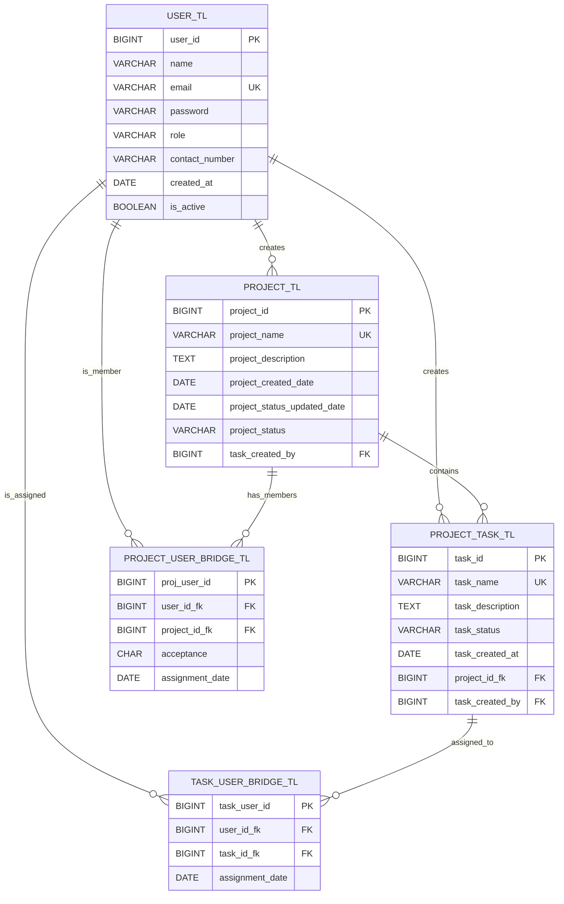

# 📊 Schéma de la Base de Données PMT

## Diagramme Entité-Relation (ERD)



## Description des tables

### 1. USER_TL (Utilisateurs)
Stocke les informations des utilisateurs de la plateforme.

| Colonne | Type | Contraintes | Description |
|---------|------|-------------|-------------|
| user_id | BIGINT | PK, AUTO_INCREMENT | Identifiant unique |
| name | VARCHAR(255) | | Nom complet |
| email | VARCHAR(255) | UNIQUE, NOT NULL | Adresse email |
| password | VARCHAR(255) | NOT NULL | Mot de passe |
| role | VARCHAR(50) | | Rôle global (ADMIN, USER) |
| contact_number | VARCHAR(20) | | Numéro de téléphone |
| created_at | DATE | | Date de création |
| is_active | BOOLEAN | DEFAULT TRUE | Compte actif |

### 2. PROJECT_TL (Projets)
Contient les projets créés sur la plateforme.

| Colonne | Type | Contraintes | Description |
|---------|------|-------------|-------------|
| project_id | BIGINT | PK, AUTO_INCREMENT | Identifiant unique |
| project_name | VARCHAR(255) | UNIQUE, NOT NULL | Nom du projet |
| project_description | TEXT | | Description |
| project_created_date | DATE | | Date de création |
| project_status_updated_date | DATE | | Date dernière MAJ statut |
| project_status | VARCHAR(50) | | Statut (TODO, IN_PROGRESS, DONE) |
| task_created_by | BIGINT | FK → USER_TL | Créateur du projet |

### 3. PROJECT_TASK_TL (Tâches)
Stocke les tâches associées aux projets.

| Colonne | Type | Contraintes | Description |
|---------|------|-------------|-------------|
| task_id | BIGINT | PK, AUTO_INCREMENT | Identifiant unique |
| task_name | VARCHAR(255) | UNIQUE, NOT NULL | Nom de la tâche |
| task_description | TEXT | | Description |
| task_status | VARCHAR(50) | | Statut (TODO, IN_PROGRESS, DONE) |
| task_created_at | DATE | | Date de création |
| project_id_fk | BIGINT | FK → PROJECT_TL, NOT NULL | Projet associé |
| task_created_by | BIGINT | FK → USER_TL | Créateur de la tâche |

### 4. PROJECT_USER_BRIDGE_TL (Membres des projets)
Table d'association entre projets et utilisateurs (many-to-many).

| Colonne | Type | Contraintes | Description |
|---------|------|-------------|-------------|
| proj_user_id | BIGINT | PK, AUTO_INCREMENT | Identifiant unique |
| user_id_fk | BIGINT | FK → USER_TL, NOT NULL | Utilisateur |
| project_id_fk | BIGINT | FK → PROJECT_TL, NOT NULL | Projet |
| acceptance | CHAR(1) | DEFAULT 'p' | Statut invitation (a=accepté, p=pending) |
| assignment_date | DATE | | Date d'assignation |

**Contrainte unique** : (user_id_fk, project_id_fk)

### 5. TASK_USER_BRIDGE_TL (Assignations de tâches)
Table d'association entre tâches et utilisateurs (many-to-many).

| Colonne | Type | Contraintes | Description |
|---------|------|-------------|-------------|
| task_user_id | BIGINT | PK, AUTO_INCREMENT | Identifiant unique |
| user_id_fk | BIGINT | FK → USER_TL, NOT NULL | Utilisateur assigné |
| task_id_fk | BIGINT | FK → PROJECT_TASK_TL, NOT NULL | Tâche |
| assignment_date | DATE | | Date d'assignation |

**Contrainte unique** : (user_id_fk, task_id_fk)

## Relations

1. **USER → PROJECT** (1:N)
   - Un utilisateur peut créer plusieurs projets
   - Un projet a un seul créateur

2. **USER → TASK** (1:N)
   - Un utilisateur peut créer plusieurs tâches
   - Une tâche a un seul créateur

3. **PROJECT → TASK** (1:N)
   - Un projet contient plusieurs tâches
   - Une tâche appartient à un seul projet

4. **USER ↔ PROJECT** (N:M via PROJECT_USER_BRIDGE)
   - Un utilisateur peut être membre de plusieurs projets
   - Un projet peut avoir plusieurs membres

5. **USER ↔ TASK** (N:M via TASK_USER_BRIDGE)
   - Un utilisateur peut être assigné à plusieurs tâches
   - Une tâche peut être assignée à plusieurs utilisateurs

## Index

```sql
CREATE INDEX idx_user_email ON user_tl(email);
CREATE INDEX idx_project_name ON project_tl(project_name);
CREATE INDEX idx_task_project ON project_task_tl(project_id_fk);
CREATE INDEX idx_task_status ON project_task_tl(task_status);
CREATE INDEX idx_bridge_project ON project_user_bridge_tl(project_id_fk);
CREATE INDEX idx_bridge_user ON project_user_bridge_tl(user_id_fk);
```
